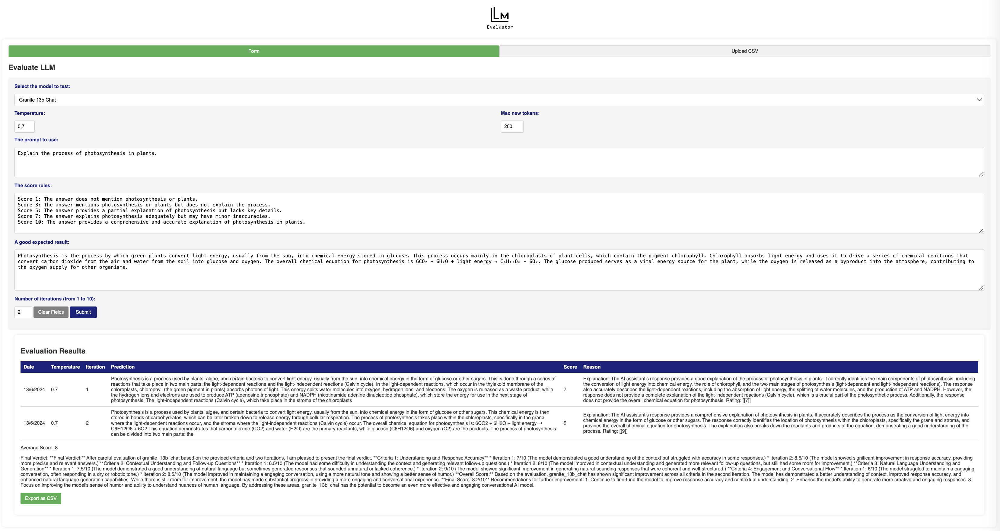
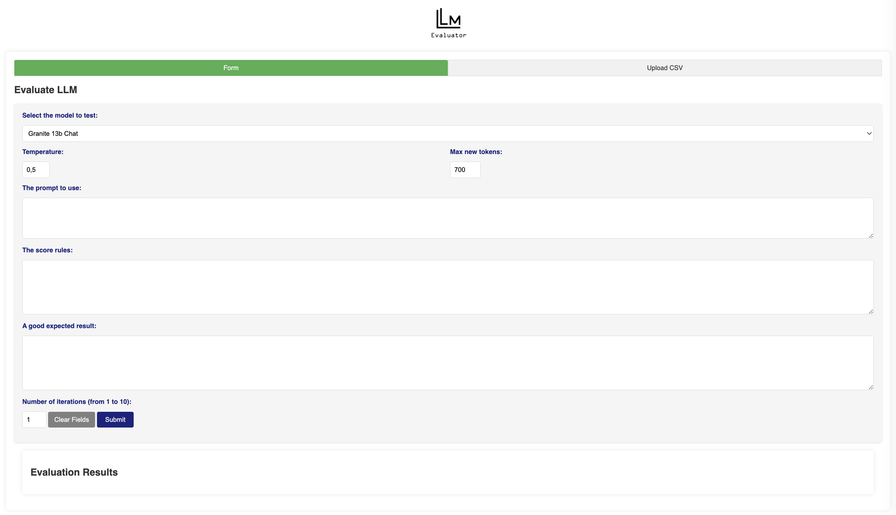

# LLM Evaluator


LLM Evaluator is a web application for evaluating the performance of language models (LLMs) on custom prompts. It allows you to select an LLM, provide a prompt, define scoring criteria, and run multiple evaluation iterations to assess the model's performance.




## Features

- Support for various LLMs including GPT-3.5, GPT-4, Claude, Amazon Titan, and more
- Customizable scoring criteria on a scale of 1-10
- Specify expected results for comparison
- Run multiple evaluation iterations
- Generates average scores and a final verdict using the LLM

## Setup

1. Clone the repository 
2. Install the required dependencies: `pip install -r requirements.txt`
3. Create a `.env` file with the following variables:
   ```
   OPENAI_API_KEY=your_openai_key
   AWS_ACCESS_KEY_ID=your_aws_access_key
   AWS_SECRET_ACCESS_KEY=your_aws_secret_key
   AWS_DEFAULT_REGION=your_aws_region
   ```
4. Run the Flask app: `python app.py`

## Usage


1. Access the app in your web browser at `http://localhost:5000`
2. Select the LLM to evaluate from the dropdown
3. Enter the prompt to evaluate
4. Define the scoring criteria on a scale of 1-10
5. Provide an expected result
6. Specify the number of evaluation iterations
7. Click "Submit" to run the evaluation
8. View the evaluation results, including scores, predictions, reasonings, average score, and final verdict

## How to Use the App

### Step-by-Step Instructions

1. **Select the Model to Test:**
   - Choose the model you want to evaluate from the dropdown menu.

2. **Set the Temperature:**
   - Adjust the temperature setting to control the randomness of the model's responses. A lower temperature will result in more deterministic responses, while a higher temperature will produce more varied responses.

3. **Enter the Prompt:**
   - Provide the prompt you want the model to respond to. For example, "Explain the process of photosynthesis in plants."

4. **Define the Scoring Criteria:**
   - Establish the criteria for scoring the model's responses. Scores should be defined on a scale from 1 to 10. Example:
     - Score 1: The answer does not mention photosynthesis or plants.
     - Score 3: The answer mentions photosynthesis or plants but does not explain the process.
     - Score 5: The answer provides a partial explanation of photosynthesis but lacks key details.
     - Score 7: The answer explains photosynthesis adequately but may have minor inaccuracies.
     - Score 10: The answer provides a comprehensive and accurate explanation of photosynthesis in plants.

5. **Provide an Expected Result:**
   - Enter an expected result for comparison. This helps in evaluating the accuracy of the model's response.

6. **Specify the Number of Evaluation Iterations:**
   - Select the number of iterations to run the evaluation. More iterations provide a better assessment of the model's performance.

7. **Submit the Evaluation:**
   - Click the "Submit" button to run the evaluation. The app will generate the results based on the defined criteria and display them.

### Example Scoring Template

To maintain consistency in scoring, follow this template:

#### Prompt: Explain the process of photosynthesis in plants.

- **Score 1:** The answer does not mention photosynthesis or plants.
- **Score 3:** The answer mentions photosynthesis or plants but does not explain the process.
- **Score 5:** The answer provides a partial explanation of photosynthesis but lacks key details.
- **Score 7:** The answer explains photosynthesis adequately but may have minor inaccuracies.
- **Score 10:** The answer provides a comprehensive and accurate explanation of photosynthesis in plants.

Example of a well-scored response:

"Photosynthesis is the process by which plants convert sunlight, water, and carbon dioxide into glucose and oxygen. It occurs in the chloroplasts of plant cells, where chlorophyll absorbs sunlight energy. The light energy is used to convert water and carbon dioxide into glucose through a series of chemical reactions. The glucose is then used by the plant for growth and energy, while the oxygen is released into the atmosphere."

## Contributing

Contributions are welcome! If you find any issues or have suggestions for improvements, please open an issue or submit a pull request.


---
